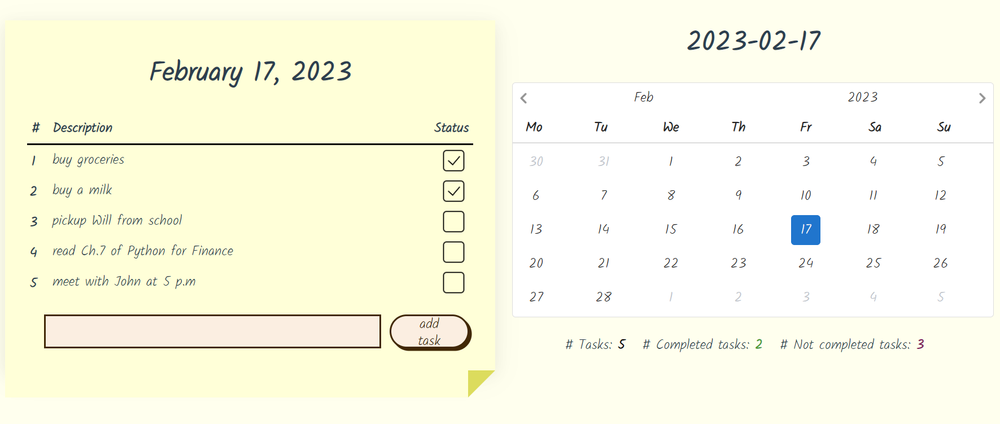
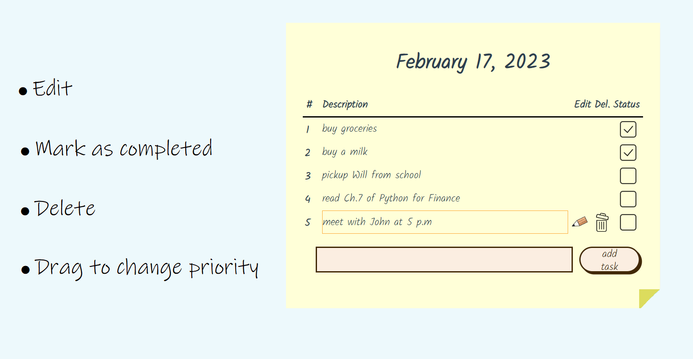
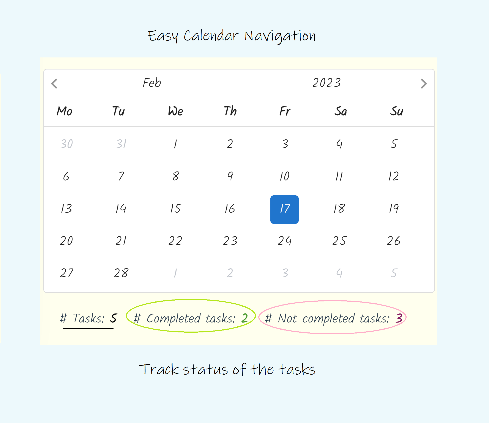
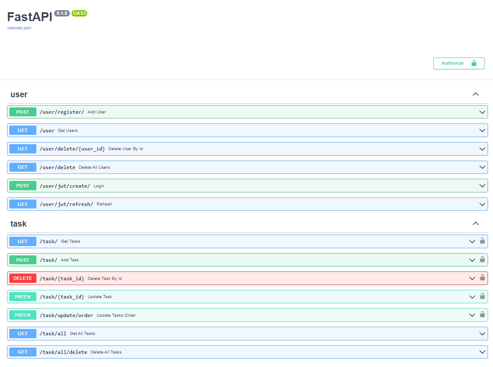

# 简单而强大的应用程序，使用 Vue 3 和 FastAPI 编写

---

## 适合人群

适合课程设计
FastAPI的学习
全栈开发的学习

### 演示

https://www.stickydo.us

<a href="https://api.stickydo.us/docs">Swagger</a>

相同的前端，但使用 <strong>DRF</strong> 作为后端 https://django.stickydo.us | 仓库: https://github.com/notarious2/Vue3DRF-To-Do

### 前端

<ul>
    <li>
        
最新的 <strong>Vue 3 Composition API</strong> 脚本设置

    </li>
    <li>
        
通过 <a href="https://github.com/SortableJS/vue.draggable.next">Vue Draggable Next</a> 实现的<strong>拖放</strong>功能以更改任务优先级

    </li>
    <li>
        
使用 <a href="https://github.com/Vuepic/vue-datepicker">Vue Datepicker</a> 实现的日期选择器

    </li>
    <li>
        
使用 <strong>Pinia</strong> 进行状态/存储管理

    </li>
    <li>
        
使用 <strong>Axios</strong> 进行 HTTP 请求，包括使用高级拦截器来<strong>刷新</strong> JWT 令牌

    </li>
    <li>
        
集成 <strong>Google Analytics</strong> 包括事件

    </li>
</ul>

### 后端

<ul>
    <li>
        
使用 Pydantic 2 的 FastAPI

    </li>
    <li>
        
这是使用sqlite和sqlmodel进行数据库管理 

    </li>
    <li>
        
Google oauth2 认证（访问令牌验证，用户创建）

    </li>
    <li>
        
用于认证的 JWT 刷新和访问令牌

    </li>
    <li>
        
用户可以使用<strong>电子邮件</strong>或<strong>用户名</strong>登录

    </li>
    <li>
        
在线提供的 Open API/Swagger 文档 <a href="https://api.stickydo.us/docs">在线</a>

    </li>
    <li>
        
使用 <strong>Black</strong> 进行代码检查和格式化

    </li>
    <li>
        
使用 <strong>UVoetry</strong> 进行包管理

    </li>
</ul>

